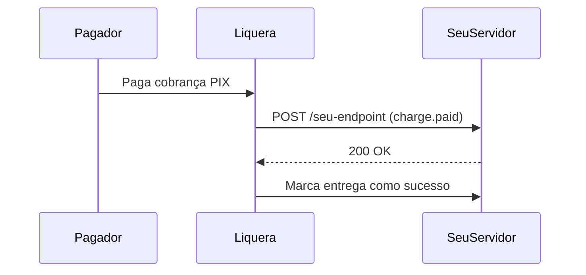

Webhooks permitem que a Liquera notifique o seu servidor automaticamente quando um pagamento é recebido, um saque é concluído ou qualquer outro evento relevante ocorre — sem que você precise fazer polling na API.

---

## Como funcionam

Quando um evento ocorre, a Liquera envia uma requisição `POST` para a URL que você cadastrou, com um payload JSON descrevendo o evento.



Se o seu servidor não retornar `2xx` dentro do timeout (5 segundos), a Liquera fará até **3 tentativas** com backoff exponencial (1 min, 2 min, 4 min...) antes de marcar a entrega como falha.

---

## Estrutura do payload

Todo evento entregue pelo webhook segue o mesmo envelope:

```json
{
  "event": "charge.paid",
  "deliveryId": "dlv_abc123",
  "timestamp": 1736950920000,
  "data": {
    "chargeId": "clx3ghi789",
    "txid": "a1b2c3d4e5f67890abcdef1234567890",
    "amount": 9990,
    "paidAt": "2025-01-15T14:22:00.000Z",
    "payer": {
      "name": "João Silva",
      "document": "12345678901"
    }
  }
}
```

| Campo | Tipo | Descrição |
|-------|------|-----------|
| `event` | `string` | Nome do evento (ex: `charge.paid`) |
| `deliveryId` | `string` | ID único desta entrega — use para deduplicação |
| `timestamp` | `number` | Momento do evento em **Unix milliseconds** (ex: `Date.now()`) |
| `data` | `object` | Payload específico do evento (varia por tipo) |

---

## Verificação do secret

Cada requisição de webhook inclui dois headers de segurança:

| Header | Descrição |
|--------|-----------|
| `x-webhook-secret` | O secret gerado na criação do webhook (valor completo) |
| `x-delivery-id` | ID único da entrega — mesmo valor do campo `deliveryId` no body |

Para validar que a requisição veio da Liquera, **compare o `x-webhook-secret` com o secret que você salvou** ao criar o webhook.

### Exemplo em Node.js

```javascript
import crypto from 'crypto';

// No seu handler Express/Fastify:
app.post('/webhooks/liquera', express.json(), (req, res) => {
  const receivedSecret = req.headers['x-webhook-secret'];
  const deliveryId = req.headers['x-delivery-id'];
  const savedSecret = process.env.LIQUERA_WEBHOOK_SECRET;

  // Comparação segura contra timing attacks
  if (!receivedSecret || !crypto.timingSafeEqual(
    Buffer.from(receivedSecret),
    Buffer.from(savedSecret)
  )) {
    return res.status(401).json({ message: 'Secret inválido' });
  }

  const { event, data, deliveryId: bodyDeliveryId, timestamp } = req.body;

  // Usar deliveryId para deduplicação (retries podem re-entregar o mesmo evento)
  const alreadyProcessed = await checkIfProcessed(bodyDeliveryId);
  if (alreadyProcessed) {
    return res.status(200).json({ received: true });
  }

  switch (event) {
    case 'charge.paid':
      await handleChargePaid(data);
      break;
    case 'withdraw.completed':
      await handleWithdrawCompleted(data);
      break;
  }

  await markAsProcessed(bodyDeliveryId);
  res.status(200).json({ received: true });
});
```

```typescript
// Fastify com TypeScript
fastify.post('/webhooks/liquera', async (request, reply) => {
  const receivedSecret = request.headers['x-webhook-secret'] as string;
  const savedSecret = process.env.LIQUERA_WEBHOOK_SECRET!;

  const isValid = crypto.timingSafeEqual(
    Buffer.from(receivedSecret ?? ''),
    Buffer.from(savedSecret)
  );

  if (!isValid) {
    return reply.status(401).send({ message: 'Secret inválido' });
  }

  const { event, data, deliveryId } = request.body as any;
  // processar evento...
  return { received: true };
});
```

<Warning>
  **Nunca compare strings de secrets diretamente com `===`.** Use sempre `crypto.timingSafeEqual()` para evitar ataques de timing que exploram diferenças de tempo na comparação byte a byte.
</Warning>

---

## Eventos disponíveis

### Cobranças

| Evento | Quando ocorre |
|--------|--------------|
| `charge.paid` | O pagamento PIX foi confirmado pelo banco |
| `charge.refunded` | A cobrança foi estornada para o pagador |

**Payload do `charge.paid`:**
```json
{
  "chargeId": "clx3ghi789",
  "txid": "a1b2c3d4e5f67890abcdef1234567890",
  "amount": 9990,
  "paidAt": "2025-01-15T14:22:00.000Z",
  "payer": {
    "name": "João Silva",
    "document": "12345678901"
  }
}
```

**Payload do `charge.refunded`:**
```json
{
  "refundId": "ref_abc123",
  "txid": "a1b2c3d4e5f67890abcdef1234567890",
  "chargeId": "clx3ghi789",
  "amount": "99.90",
  "status": "closed",
  "reason": "Solicitação do cliente",
  "end2endId": "E1234567820250115..."
}
```

### Saques

| Evento | Quando ocorre |
|--------|--------------|
| `withdraw.completed` | A transferência PIX do saque foi concluída com sucesso |
| `withdraw.failed` | O saque foi rejeitado pelo banco destino — saldo revertido automaticamente |
| `withdraw.refunded` | A transferência foi devolvida pelo banco destino — saldo revertido automaticamente |

**Payload do `withdraw.completed`:**
```json
{
  "withdrawId": "clx5mno345",
  "amount": 50000,
  "status": "COMPLETED",
  "transferId": "tf_xyz789",
  "completedAt": "2025-01-15T15:05:00.000Z"
}
```

**Payload do `withdraw.failed`:**
```json
{
  "withdrawId": "clx5mno345",
  "amount": 50000,
  "status": "FAILED",
  "reason": "Chave PIX inválida ou inexistente"
}
```

### Chave PIX

| Evento | Quando ocorre |
|--------|--------------|
| `pixkey.updated` | O status da sua chave PIX foi atualizado (ativação, inativação) |

**Payload:**
```json
{
  "keyId": "pix_key_id_acquirer",
  "key": "voce@empresa.com.br",
  "type": "EMAIL",
  "status": "ATIVA"
}
```

### Infrações

| Evento | Quando ocorre |
|--------|--------------|
| `infraction.received` | Nova infração PIX (MED) recebida |
| `infraction.updated` | Status de uma infração foi atualizado |
| `infraction.refund_completed` | Reembolso de uma infração foi concluído |

---

## Wildcards

Se você criar um webhook **sem especificar eventos**, ele receberá **todos os eventos** automaticamente. Útil para logging geral ou durante desenvolvimento.

---

## Logs de entrega

Você pode consultar os logs das últimas 20 entregas de cada webhook via `GET /v1/webhooks/merchant`. Cada log inclui:

- O payload enviado
- O status HTTP retornado pelo seu servidor
- O número de tentativas realizadas
- Se a entrega foi bem-sucedida

Use os logs para debugar problemas de integração sem precisar do suporte.

---

## Boas práticas

- **Retorne `200` rapidamente:** Processe o evento de forma assíncrona e retorne `200 OK` imediatamente. Operações lentas dentro do handler fazem o webhook atingir o timeout e ser reentregue.
- **Seja idempotente:** É possível receber o mesmo evento mais de uma vez (retries). Use o `deliveryId` para evitar processamento duplicado — salve-o no banco antes de processar.
- **Valide sempre o secret:** Nunca processe um evento sem verificar o header `x-webhook-secret`.
- **Monitore os logs:** Consulte periodicamente os logs de entrega para garantir que todos os eventos estão sendo processados com sucesso.
