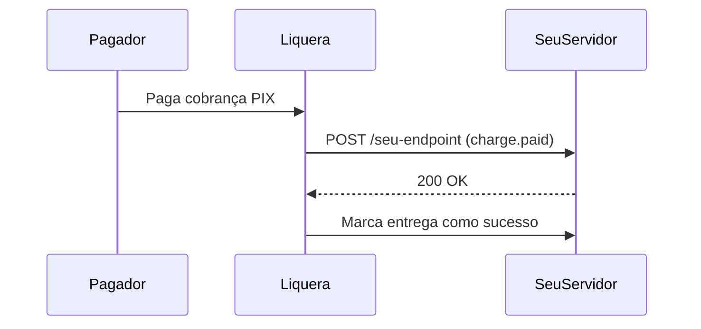

Webhooks permitem que a Liquera notifique o seu servidor automaticamente quando um pagamento é recebido, um saque é concluído ou qualquer outro evento relevante ocorre — sem que você precise fazer polling na API.

---

## Como funcionam

Quando um evento ocorre, a Liquera envia uma requisição `POST` para a URL que você cadastrou, com um payload JSON descrevendo o evento.



Se o seu servidor não retornar `2xx` dentro do timeout (5 segundos), a Liquera fará até **3 tentativas** com intervalo crescente antes de marcar a entrega como falha.

---

## Estrutura do payload

Todo evento entregue pelo webhook segue o mesmo envelope:

```json
{
  "event": "charge.paid",
  "timestamp": "2025-01-15T14:22:00.000Z",
  "data": {
    "chargeId": "clx3ghi789",
    "txid": "a1b2c3d4e5f67890abcdef1234567890",
    "amount": 9990,
    "paidAt": "2025-01-15T14:22:00.000Z",
    "payer": {
      "name": "João Silva",
      "document": "12345678901"
    }
  }
}
```

| Campo | Tipo | Descrição |
|-------|------|-----------|
| `event` | `string` | Nome do evento (ex: `charge.paid`) |
| `timestamp` | `string` | Momento do evento em ISO 8601 |
| `data` | `object` | Payload específico do evento (varia por tipo) |

---

## Verificação de assinatura (HMAC-SHA256)

Cada requisição de webhook inclui o header `x-webhook-signature` com uma assinatura HMAC-SHA256. **Sempre valide esta assinatura** para garantir que a requisição veio da Liquera e não foi adulterada.

### Como calcular

A assinatura é calculada sobre o corpo bruto (raw body) da requisição:

```
HMAC-SHA256(secret, rawBody)
```

### Exemplo em Node.js

```javascript
import crypto from 'crypto';

function verifyWebhookSignature(rawBody, signature, secret) {
  const expected = crypto
    .createHmac('sha256', secret)
    .update(rawBody)
    .digest('hex');

  // Comparação segura contra timing attacks
  return crypto.timingSafeEqual(
    Buffer.from(expected, 'hex'),
    Buffer.from(signature, 'hex')
  );
}

// No seu handler Express/Fastify:
app.post('/webhooks/liquera', express.raw({ type: 'application/json' }), (req, res) => {
  const signature = req.headers['x-webhook-signature'];
  const secret = process.env.LIQUERA_WEBHOOK_SECRET;

  if (!verifyWebhookSignature(req.body, signature, secret)) {
    return res.status(401).json({ message: 'Assinatura inválida' });
  }

  const event = JSON.parse(req.body);
  
  switch (event.event) {
    case 'charge.paid':
      // processar pagamento confirmado
      break;
    case 'withdraw.completed':
      // processar saque concluído
      break;
  }

  res.status(200).json({ received: true });
});
```

<Warning>
  Sempre use o **raw body** (antes do JSON.parse) para calcular a assinatura. Usar `req.body` já parseado pode alterar a ordem dos campos e invalidar a verificação.
</Warning>

---

## Eventos disponíveis

### Cobranças

| Evento | Quando ocorre |
|--------|--------------|
| `charge.paid` | O pagamento PIX foi confirmado pelo banco |
| `charge.refunded` | A cobrança foi estornada para o pagador |

**Payload do `charge.paid`:**
```json
{
  "chargeId": "clx3ghi789",
  "txid": "a1b2c3d4e5f67890abcdef1234567890",
  "amount": 9990,
  "paidAt": "2025-01-15T14:22:00.000Z",
  "payer": {
    "name": "João Silva",
    "document": "12345678901"
  }
}
```

**Payload do `charge.refunded`:**
```json
{
  "refundId": "ref_abc123",
  "txid": "a1b2c3d4e5f67890abcdef1234567890",
  "chargeId": "clx3ghi789",
  "amount": "99.90",
  "status": "closed",
  "reason": "Solicitação do cliente",
  "end2endId": "E1234567820250115..."
}
```

### Saques

| Evento | Quando ocorre |
|--------|--------------|
| `withdraw.completed` | A transferência PIX do saque foi concluída com sucesso |
| `withdraw.failed` | O saque foi rejeitado pelo banco destino — saldo revertido automaticamente |
| `withdraw.refunded` | A transferência foi devolvida pelo banco destino — saldo revertido automaticamente |

**Payload do `withdraw.completed`:**
```json
{
  "withdrawId": "clx5mno345",
  "amount": 50000,
  "status": "COMPLETED",
  "transferId": "tf_xyz789",
  "completedAt": "2025-01-15T15:05:00.000Z"
}
```

**Payload do `withdraw.failed`:**
```json
{
  "withdrawId": "clx5mno345",
  "amount": 50000,
  "status": "FAILED",
  "reason": "Chave PIX inválida ou inexistente"
}
```

### Chave PIX

| Evento | Quando ocorre |
|--------|--------------|
| `pixkey.updated` | O status da sua chave PIX foi atualizado (ativação, inativação) |

**Payload:**
```json
{
  "keyId": "pix_key_id_acquirer",
  "key": "voce@empresa.com.br",
  "type": "EMAIL",
  "status": "ATIVA"
}
```

### Infrações

| Evento | Quando ocorre |
|--------|--------------|
| `infraction.received` | Nova infração PIX (MED) recebida |
| `infraction.updated` | Status de uma infração foi atualizado |
| `infraction.refund_completed` | Reembolso de uma infração foi concluído |

---

## Wildcards

Se você criar um webhook **sem especificar eventos**, ele receberá **todos os eventos** automaticamente. Útil para logging geral ou durante desenvolvimento.

---

## Logs de entrega

Você pode consultar os logs das últimas 20 entregas de cada webhook via `GET /v1/webhooks/merchant`. Cada log inclui:

- O payload enviado
- O status HTTP retornado pelo seu servidor
- O número de tentativas realizadas
- Se a entrega foi bem-sucedida

Use os logs para debugar problemas de integração sem precisar do suporte.

---

## Boas práticas

- **Retorne `200` rapidamente:** Processe o evento de forma assíncrona e retorne `200 OK` imediatamente. Não faça operações lentas dentro do handler.
- **Seja idempotente:** É possível receber o mesmo evento mais de uma vez (retries). Use o `chargeId` ou `withdrawId` para evitar processamento duplicado.
- **Valide sempre a assinatura:** Nunca processe um evento sem verificar o `x-webhook-signature`.
- **Monitore os logs:** Consulte periodicamente os logs de entrega para garantir que todos os eventos estão sendo processados com sucesso.
